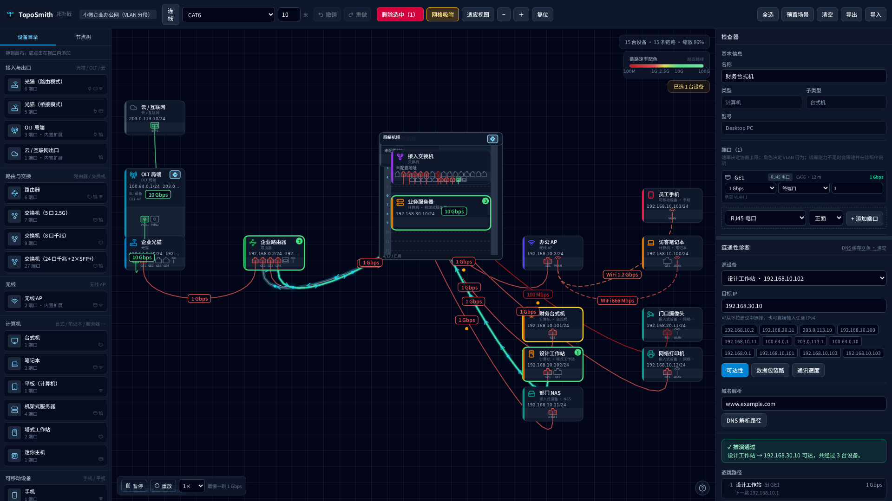

<p align="center">
  <picture>
    <source media="(prefers-color-scheme: dark)" srcset="assets/brand/logo-on-dark.svg">
    
  </picture>
</p>

<p align="center">
  <b>浏览器内的网络拓扑绘制与连通性推演器</b><br>
  <sub>手动画拓扑 → 精细标注端口速率与线缆类型 → 让工具回答<b>通不通、走哪条路、能跑多快、域名怎么解析过去</b>，并给出<b>为什么</b>。</sub>
</p>

<p align="center">
  <a href="LICENSE"></a>
  
  
  
  
  
</p>

<p align="center">
  
  <br>
  <sub>预置场景「小微企业办公网」：三个 VLAN 分段 + 机柜上架；图中正在推演 <b>设计工作站 → 业务服务器</b> 的跨 VLAN 可达性（3 跳可达，瓶颈 1 Gbps）。</sub>
</p>

## 这是什么

TopoSmith 不是逐包网络仿真器，而是**确定性推演器**：从拓扑与配置出发，用图算法 + 约束求解
算出路径、可达性、带宽与 DNS 解析链，并输出完整**证据链**。

- ✅ 纯前端、零后端、可静态托管
- ✅ 线缆类型/长度与端口介质/速率**参与计算**（不是装饰字段）
- ✅ 结果确定可复现：同输入同输出，引擎里没有随机数与时钟
- ❌ 不做逐包仿真、不跑真实设备镜像、不提供 CLI（见 [`docs/00-overview.md`](docs/00-overview.md) §5）

## 功能

**绘制与编辑**
- 设备目录拖放；端口**画在设备面板上**（网口 / 光口 / PON / 天线按介质绘制），点端口即编辑详情
- **端口到端口的电缆曲线**：连线明确从端口出发，线缆类型与长度参与协商
- 端口可增删；卡片宽度可调；**机柜容器**（8–48U 上架下架、翻转看背面、悬浮透视）
- **有背板端口的设备悬浮即半透明**，直接看到背面端口；设备自身也可翻面
- 框选与 Ctrl/Shift 多选；六向对齐 + 两轴等距分布；网格与节点吸附（带引导线）
- 撤销重做（含拖动事务合并）、导入导出、节点树（搜索 / 排序 / 双击定位）

**推演与诊断（四类，全部带证据链）**
- **可达性**：能不能通，不通卡在哪一跳、原因码是什么
- **数据包链路**：逐跳列出设备、端口、链路速率、VLAN 与地址
- **通讯速度**：端到端瓶颈在哪一段、单向时延、单流有效吞吐
- **DNS 解析路径**：域名 → 哪台服务器 → 缓存命中 / 转发 / NXDOMAIN

**可视化**
- 诊断后播放**流向动画**：粒子速度按链路速率对数映射、逐跳停顿、失败停在阻断点并红脉冲
- 连线与速率标签按带宽着色（**1G 红 → 10G 绿**，对数均匀分配，右上角图例）
- 拖设备时**连线有平面物理摆动**（位移冲量 + 弹簧回零），快甩甩得远、松手回摆几下
- 适应视图按真实画布尺寸把「设备 ∪ 连线」完整装入；缩放 5%–400%；低缩放自动分级绘制

## 预置场景

工具栏「预置场景」打开选择弹窗，六套开箱可用、且**各自演示一类能力**的拓扑：

| 场景 | 规模 | 演示什么 | 有意留的坑 |
|---|---|---|---|
| 家庭网络 | 10 台 · 9 线 | 光猫路由模式做 NAT/DHCP、AP 无线、PON 接入、DNS 转发链 | — |
| **小微企业办公网** | 15 台 · 15 线 | VLAN 分段（办公/访客/服务器）、跨 VLAN 路由、机柜上架 | 访客段上联口忘打标，ping 摄像机会报「两端不在同一广播域」并指名两个端口 |
| 机房机柜 | 12 台 · 12 线 | 42U 机柜与多 U 上架、背面端口透视、万兆 DAC、瓶颈定位 | — |
| 光接入 | 10 台 · 9 线 | 同一 OLT 两户：**桥接光猫 + 自备路由** vs 路由光猫一台搞定 | B 户老光猫是 EPON 1G，那条 PON 按 1G 协商 |
| 园区无线 | 13 台 · 12 线 | 三台 AP 同 SSID、2.4G/5G/6G 速率按两端取小、无线共享介质 | 一台平板配错 SSID，链路起不来并报 SSID 不一致 |
| 中型托管 IDC | **810 台 · 809 线** | 3 机房 × 24 柜 × 42U 满配、双千兆上联 → 汇聚 → 万兆核心 → 出口；兼作**规模压测** | — |

每个场景都是**自洽的地址规划**，并被单测逐条验证「说明里承诺的行为真的成立」，
包括「把有意留的坑修好之后恢复连通」。

## 快速开始

需要 Node ≥ 20 与 pnpm 11；零后端，构建产物是纯静态文件。

```bash
# ⚠️ 本机环境变量里的代理（192.168.1.161:40404）已失效，安装必须绕过它
env -u http_proxy -u https_proxy -u HTTP_PROXY -u HTTPS_PROXY pnpm install

pnpm dev          # 开发服务器（必须经 DevHub 启停，见下）
pnpm typecheck    # 全量类型检查（4 个包）
pnpm test         # 引擎单元测试（31 项）
pnpm test:web     # 前端单元测试（182 项）
pnpm build        # 构建静态产物到 apps/web/dist
pnpm screenshot   # 重新生成 README 的界面截图
pnpm brand        # 由 assets/brand 重新生成 favicon / PNG
```

开发服务器**必须经 DevHub 启停**（禁止裸 `pnpm dev &`）：

```bash
~/.devhub/devctl start toposmith dev --wait-ready
~/.devhub/devctl logs toposmith dev --follow
~/.devhub/devctl stop toposmith dev
```

| 项 | 值 |
|---|---|
| 监听 | `0.0.0.0:31006`（`strictPort`，不漂移） |
| 信任域名 | `toposmith.dev-u26-001.services.local` |
| 访问 | `http://127.0.0.1:31006` 或 `http://toposmith.dev-u26-001.services.local:31006` |

## 项目结构

```
toposmith/
├─ docs/                需求、领域模型、目录表、架构、引擎、诊断契约、路线图、决策记录
├─ assets/brand/        标识源文件：mark.svg（图形）+ 两种主题的字标
├─ scripts/             构建脚本：品牌产物、README 截图（共用 playwright 加载器）
├─ packages/
│  ├─ schema/           类型定义 + 导入校验（输入契约）
│  ├─ catalog/          设备 / 端口 / 线缆 / 速率目录（纯数据）
│  └─ engine/           推演内核（纯 TS，零 DOM/React，可在 Node 下直接测试）
└─ apps/web/            React 19 + Vite 8 + Tailwind 4 + zustand（样式全部内联类名）
```

**依赖方向严格单向：`web → engine → catalog → schema`。** 引擎不认识 React、不认识画布，
所以「为什么这条链路只有 2.5G」这类判断可以在 Node 下直接写单测（`packages/engine/src/__tests__`）。

## 文档

| 文档 | 内容 |
|---|---|
| [`docs/00-overview.md`](docs/00-overview.md) | 定位、核心判断（推演 ≠ 仿真）、非目标、术语 |
| [`docs/01-requirements.md`](docs/01-requirements.md) | FR-01…FR-60 全量需求与逐条验收标准、NFR、已知不做 |
| [`docs/02-domain-model.md`](docs/02-domain-model.md) | 领域模型、数据 Schema、不变量 |
| [`docs/03-catalog.md`](docs/03-catalog.md) | 设备/端口/线缆目录与五条物理硬约束 |
| [`docs/04-architecture.md`](docs/04-architecture.md) | 分层、包边界、渲染方案、状态管理 |
| [`docs/05-engine.md`](docs/05-engine.md) | 链路协商、广播域、路由、逐跳推演、带宽、DNS |
| [`docs/06-addressing.md`](docs/06-addressing.md) | IP / 网段 / VLAN / DHCP / DNS 模型 |
| [`docs/07-diagnostics.md`](docs/07-diagnostics.md) | 诊断输出契约、原因码表、证据链呈现规范 |
| [`docs/08-roadmap.md`](docs/08-roadmap.md) | M0–M4 里程碑、逐轮实测数据与风险登记 |
| [`docs/DECISIONS.md`](docs/DECISIONS.md) | 决策记录（D-01…D-45，含「为什么没选另一条路」与代价） |

## 质量与验证

- **引擎单测 31 项**覆盖链路协商、广播域、路由、DHCP/DNS、四类诊断与原因码；
- **前端单测 182 项**覆盖几何 / 端口布局 / 折线弧长 / 标签几何 / 摆动物理 / 适应视图 /
  节点树 / store 行为，以及**六套预置场景的行为承诺**；
- 端到端脚本用真实 Chromium 驱动，覆盖启动、四类诊断、多选与框选、对齐吸附、机柜与翻转、
  标签拖拽、悬浮透视、弹窗流程与**性能预算**（`.verify/` 下，属本机脚本、不入库）；
- **规模压测**（中型 IDC 场景，810 台设备 / 809 条链路，实测）：

  | 指标 | 数值 |
  |---|---|
  | 场景构建 / 载入一整套 | 4.7 ms / 65 ms |
  | 拖动设备的帧时间 | 中位 **33 ms**、p90 83 ms（优化前 100 / 250 ms） |
  | 一次跨机房可达性推演 | 16 ms |
  | 存档体积 | 1008 KB |

  这轮压测促成的四项优化（位置专用快路径、拖动期间推迟落盘、细节分级 LOD、绘制与命中同判据）
  与仍存在的限制（React 每帧全量重渲染、节点树无虚拟滚动）记在
  [`docs/DECISIONS.md`](docs/DECISIONS.md) D-44 与路线图的已知缺口里。

## 品牌标识


六边形徽章（机架螺栓 / 网络织物的双关）+ 徽章内的 T 形拓扑：**方形枢纽是交换机 / 机架设备、
圆形端点是终端**，顶杠连线带轻微下垂 —— 与画布上电缆的形态一致；配色取应用速率色标两端
（青 → 蓝 → 绿）。

| 文件 | 用途 |
|---|---|
| `assets/brand/mark.svg` | 图形标识源文件（**唯一的几何事实来源**） |
| `assets/brand/logo-on-dark.svg` / `logo-on-light.svg` | 横版字标，README 用 `<picture>` 按主题选择 |
| `apps/web/public/favicon.svg`、`favicon-16/32.png`、`apple-touch-icon.png`、`icon-192/512.png` | 由 `pnpm brand` 派生，**勿手工编辑**（`manifest.webmanifest` 引用后两者） |

改标识只需改 `assets/brand/mark.svg`（字标几何同步），然后跑一次 `pnpm brand`。

## 本机环境注意事项（实测踩过的坑）

1. **会话里的代理是过期值**：本会话环境变量 `http_proxy/https_proxy` 指向
   `192.168.1.161:40404`（No route to host），但系统登录 shell 的配置
   `/etc/profile.d/proxy.sh` 写的是 **`10.0.30.81:40404`，实测可用**。
   两者不一致源于 2026-09-14 的一次代理迁移。直连 registry 同样可用，
   因此上面的安装命令直接绕过代理；若需要走代理，请用 `http://10.0.30.81:40404`。
2. **pnpm 11 不再读取项目 `.npmrc`**：pnpm 配置写在 `pnpm-workspace.yaml`。
   其中的 `storeDir` 指向工作区内的 `.pnpm-shared-store` —— 因为默认 store 在会话工作区之外，
   被文件沙箱置为只读，会报 `[ERR_SQLITE_ERROR] unable to open database file`。
   **换机器/换工作区时这一行必须改。**
3. **开发服务器必须经 DevHub 启停**：`~/.devhub/registry` 与 `~/.devhub/state` 在工作区之外，
   登记/启动命令可能需要一次提权重试（见 `~/.devhub/README.md`）。
4. **开发容器没有中文字体**：`fc-match sans-serif:lang=zh-cn` 会落到 DejaVu Sans，
   在此容器内截图时中文显示为方框。应用已显式声明中文字体族
   （`index.css` 的 `--font-sans` 与画布 `UI_FONT`），客户端上显示正常；
   本机截图可准备一份只加一个字体目录的 fontconfig 并把 `FONTCONFIG_FILE` 指给它
   （`pnpm screenshot` 会在未设置时给出提示）。

## 第三方资源与许可

| 资源 | 版本 | 许可 | 用途 |
|---|---|---|---|
| [Lucide](https://lucide.dev) | 1.46.0 | **ISC**（商用免费，无需在 UI 署名） | 设备/端口/界面图标，画布 `Path2D` 与 SVG 组件共用同一份数据 |

项目不包含任何厂商设备镜像、商标素材或私有配置文件；目录中的设备与线缆参数
均为公开标准（TIA/EIA、IEEE 802.3/802.11、ISO/IEC 11801）的数值事实。

## 许可

[MIT](LICENSE) © 2026 Dynesshely
